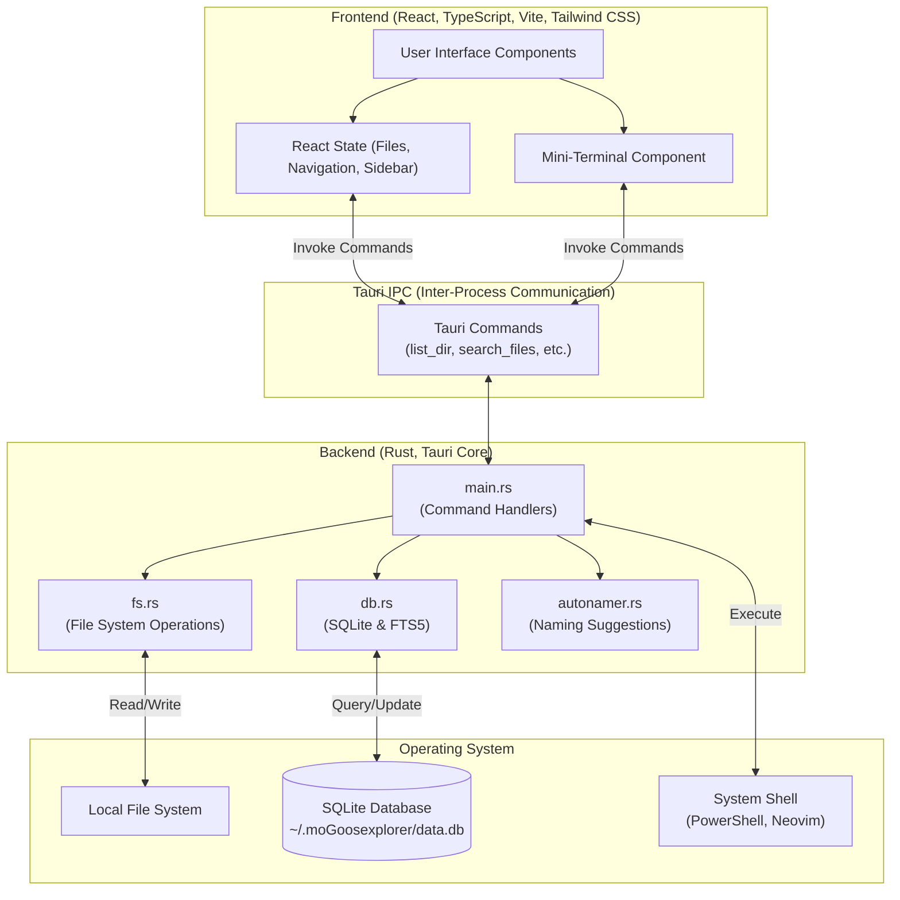

# GooseXplorer 🪿

GooseXplorer is a modern, high-performance, and feature-rich desktop File Explorer built on **Tauri v2**, **Rust**, **React**, and **TypeScript**. It offers advanced file tagging, fuzzy path/metadata search powered by SQLite (FTS5), shell integration, automatic filename suggestion, and a sleek, developer-friendly dark user interface.

## Architecture

The application is structured into two main layers communicating via Tauri's IPC bridge.



## Key Features

- **Directory & Drive Navigation**
  - Instant directory listings sorted intelligently (directories first, then files, both case-insensitive alphabetical).
  - Quick-access sidebar populated automatically with standard system folders (Desktop, Documents, Downloads, Music, Pictures, Videos) via OS-specific home paths.
  - Automatic Windows drive scanner (from `C:\` through `Z:\`).
  - Customizable personal shortcuts ("Custom Places").

- **Smart Metadata & Tagging**
  - Add descriptive notes and comma-separated tags to any file or folder.
  - Tagged files are indexed in a local SQLite database (`~/.moGoosexplorer/data.db`).
  - Instant FTS5 (Full Text Search) indexing lets you search across all file descriptions and tags.

- **Smart Autonamer**
  - Automatically suggests clean, formatted titles for files based on standard name pattern cleaning.
  - Sanitizes underscores and dashes, strips extensions, and parses various date patterns into friendly dates.

- **Developer Integrations**
  - **Neovim (LazyVim)**: Launch Neovim directly in a new terminal window inside the target path.
  - **PowerShell**: Instantly open PowerShell mapped to the selected folder.
  - **Built-in Mini-Terminal**: Execute quick shell commands directly inside the app with immediate stderr/stdout display.

- **Modern Design & User Interface**
  - Completely custom frameless window wrapper with native minimize, maximize, and exit controls.
  - Glassmorphic, dark theme UI styled with TailwindCSS.
  - Context menu actions for directory navigation, opening in editor/shell, and metadata management.

## Directory Structure

```text
├── src/                      # Rust Backend Source Code
│   ├── main.rs               # Entry point, Tauri setups & command registration
│   ├── autonamer.rs          # Filename cleaning and date pattern suggestions
│   ├── db.rs                 # SQLite connection, tables (settings, files, files_fts)
│   ├── fs.rs                 # Disk operations, drives listing & home folder mappings
│   └── search.rs             # (Unused placeholder)
│
├── ui-web/                   # React Frontend Source Code
│   ├── src/
│   │   ├── App.tsx           # Main UI application layout, state & Tauri bridge
│   │   ├── main.tsx          # React application root render
│   │   └── index.css         # Styling, Tailwind imports, custom scrollbars
│   ├── public/               # Public assets directory (Vite)
│   ├── package.json          # Node dependencies & dev scripts
│   └── vite.config.ts        # Vite configuration
│
├── icons/                    # App execution icons for packaging & window title bar
├── Cargo.toml                # Rust dependencies & package configuration
└── tauri.conf.json           # Tauri v2 runtime & compile configuration
```

## Getting Started

### Prerequisites

- **Rust**: Ensure you have the Rust toolchain installed (via [rustup](https://rustup.rs/)).
- **Node.js**: Node 18+ and `npm` or `yarn`.

### Installation & Run

1. **Install Frontend Dependencies:**
   Navigate to the `ui-web` folder and install packages:
   ```bash
   cd ui-web
   npm install
   ```

2. **Run the Application in Development Mode:**
   Start the frontend development server:
   ```bash
   npm run dev
   ```
   *The Vite dev server will run on `http://localhost:5173`.*

3. **Launch the Tauri App Window:**
   In another terminal (or root folder), run the Tauri development runner:
   ```bash
   cargo tauri dev
   ```
   *(Ensure you have the Tauri CLI installed: `cargo install tauri-cli` or run `npx tauri dev`)*

## Technical Details

- **Database**: Metadata is persisted in an SQLite file located at `~/.moGoosexplorer/data.db` (under your home directory).
- **Search Table**: Uses a virtual table `files_fts` employing the SQLite `fts5` module to index path, description, and tags for rapid fuzzy text matches.
- **Window Management**: Uses the `@tauri-apps/api/window` client library to handle maximize, minimize, and close window operations from the frameless UI header.
